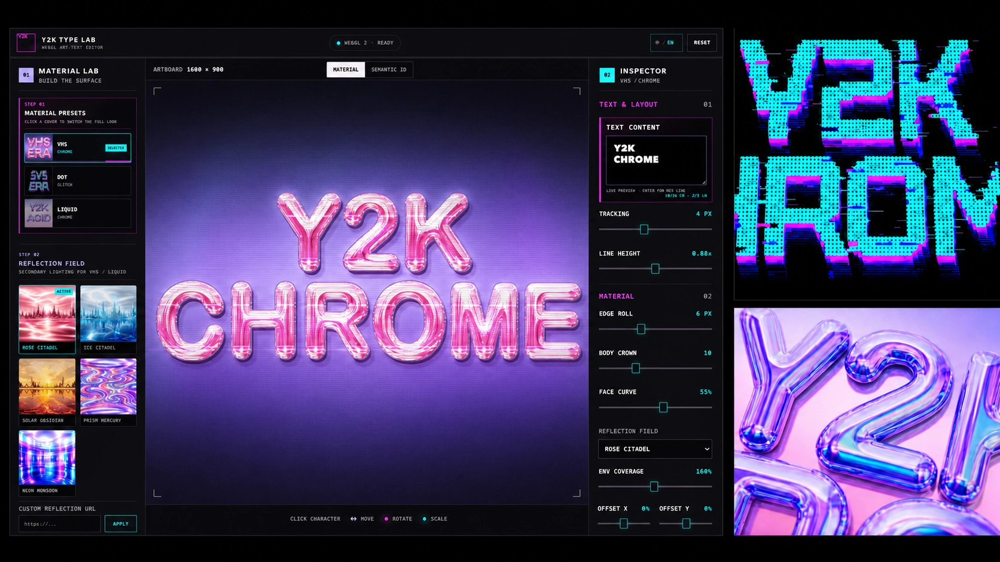
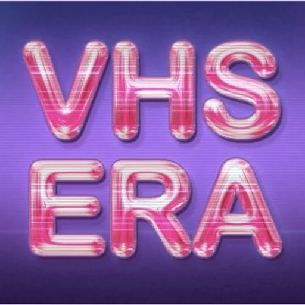
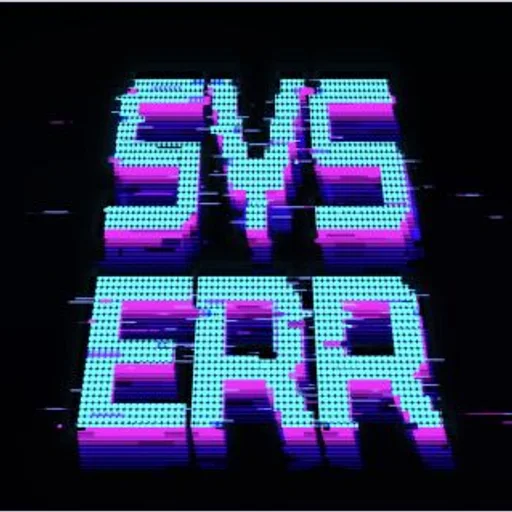
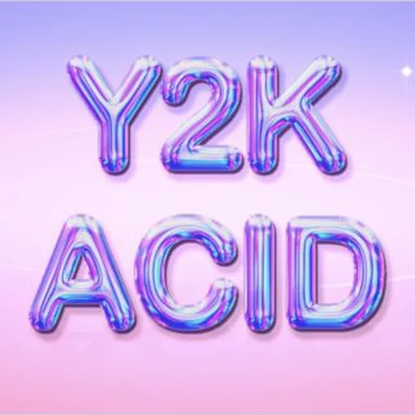
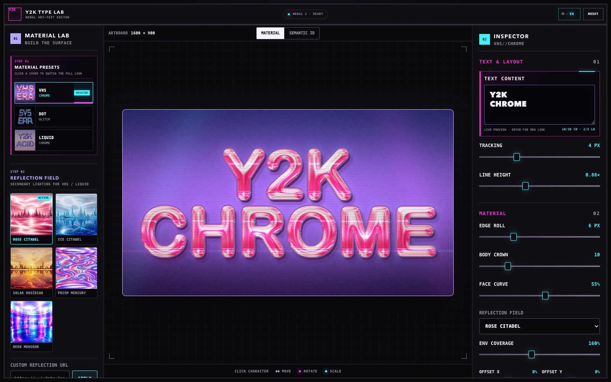
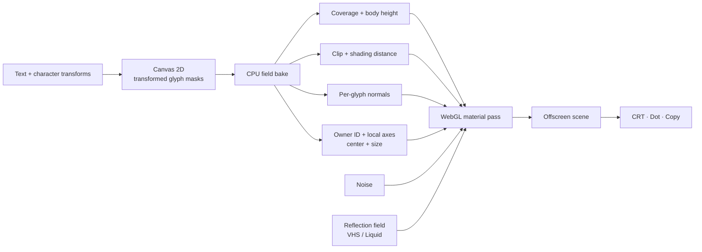

# Y2K Type Lab

**English** · [简体中文](./README.zh-CN.md)


A browser editor for chrome, liquid, and dot-matrix lettering. Type a few
lines, choose a material, then move, rotate, and scale individual characters.
Reflections, scanlines, dots, and depth stay aligned with the edited glyphs.

**[▶ Open Y2K Type Lab](https://sylvanyu.io/y2k-type-lab/)** · Requires a browser with WebGL.



## Materials

<table>
  <tr>
    <td width="33.3%"></td>
    <td width="33.3%"></td>
    <td width="33.3%"></td>
  </tr>
  <tr>
    <td><strong>VHS Chrome</strong><br />Reflective type split into scanlines, RGB ghosts, row dropouts, and a CRT finish.</td>
    <td><strong>Dot Glitch</strong><br />A Tektur dot face with stacked outlines, perspective depth, channel offsets, and signal tears.</td>
    <td><strong>Liquid Chrome</strong><br />A rounded surface with warped reflections, soft highlights, depth, and a clean display pass.</td>
  </tr>
</table>

VHS Chrome and Liquid Chrome take their reflected color and detail from an
image. The editor includes Rose Citadel, Ice Citadel, Solar Obsidian, Prism
Mercury, and Neon Monsoon. A custom `https:`, `data:image`, or `blob:` URL works
too; remote images must allow cross-origin access.

Dot Glitch does not use a reflection field. Its face comes from the text
distance field, a procedural dot grid, layered depth, and signal displacement.

## Editor



Material Lab on the left holds the presets, reflection fields, and generated
material maps. Inspector on the right handles text, surface shape, material
response, and display effects. On a narrow screen, the same controls move into
Type, Field, Material, and FX tabs.

### Character controls

| Input | Action |
| --- | --- |
| Click a character | Select it |
| Drag a character | Move it |
| Drag the magenta handle | Rotate it |
| `Shift` while rotating | Snap to 15° steps |
| Drag the cyan handle | Scale it |
| `Page Up` / `Page Down` or `[` / `]` | Select the previous or next character |
| Arrow keys | Move by 1 px |
| `Shift` + arrow keys | Move by 10 px |
| `Alt` / `Option` + left/right | Rotate by 1° |
| `Alt` / `Option` + `Shift` + left/right | Rotate by 15° |
| `Alt` / `Option` + up/down | Scale by 1% |
| `Alt` / `Option` + `Shift` + up/down | Scale by 10% |
| `Esc` | Clear the selection |

Selecting a character also opens numeric X, Y, rotation, and scale controls.
**Reset Character** clears that character's transform; **Reset All Layout**
clears every character transform.

### Material controls

| Group | Controls |
| --- | --- |
| Type | Text, tracking, and line height |
| Chrome surface | Edge roll, body crown, and face curve |
| Reflection | Field, coverage, X/Y offset, reflectivity, field strength, roughness, and base color |
| VHS Chrome | Scanline gap and scanline strength |
| Liquid Chrome | Liquid warp |
| Dot Glitch | Dot size, outline thickness, and glitch strength |
| Shared finish | Perspective angle, depth, edge glow, scene detail, edge color, and reflection color |

Each material keeps its own settings while the page is open. Switching away
from VHS Chrome and back restores the VHS values you were using. The top-level
**Reset** restores the active preset and returns to Material view; it leaves
the text and character transforms alone.

**Semantic ID** replaces the finished image with the character ownership map.
The expandable Material Maps panel exposes the live coverage, body height,
distance, normal, noise, and ID buffers used for the current frame. Every card
is a live view of one renderer input or packed channel.

## Run locally

Clone the repository and serve its root directory:

```bash
git clone https://github.com/sylvanyu-io/y2k-type-lab.git
cd y2k-type-lab
python3 -m http.server 4173
```

Open [http://127.0.0.1:4173/](http://127.0.0.1:4173/) in a browser with WebGL
enabled. The renderer uses WebGL 2 when available and falls back to WebGL 1.
The editor itself runs from static files, so local editing needs no package
installation or application build.

## Rendering notes

The editor keeps two views of the lettering: one merged silhouette for the
whole artwork, and separate surface data for every visible character.



### From glyph masks to surface maps

Canvas 2D measures the text and draws each glyph after its translation,
rotation, and scale have been applied. A two-dimensional Euclidean distance
transform turns the resulting mask into a signed distance field.

The renderer uploads four main pieces of surface data:

| Data | Contents |
| --- | --- |
| Shape | Antialiased coverage, merged body height, and the overlap outline used by VHS Chrome |
| Distance | A long-range clipping SDF and a shorter, smoother shading SDF |
| Normal | The surface normal built from Edge Roll, Body Crown, and Face Curve |
| Semantic ID + metadata | Visible owner, local rotation axes, center, and size for each character |

The merged distance field supplies one coherent outside contour, extrusion,
glow, and shadow. Normals take a different route. Each character is baked in
its own cropped region, then the results are composited in Canvas drawing
order. At an overlap, the front character keeps its own rounded surface instead
of both letters inflating into one shape.

Changing Edge Roll, Body Crown, or Face Curve reuses those cached character
regions and rebuilds only the normal texture. Text, tracking, line height, and
character transforms trigger the full field bake. Reflection, color,
roughness, depth, glow, perspective, and signal controls stay in shader
uniforms and update without rebuilding the glyph masks.

### Keeping material coordinates on each character

Every visible character has an owner ID. The semantic texture stores that ID
alongside the character's rotated local axes; a metadata texture stores its
center and size. The fragment shader can therefore turn a canvas position back
into coordinates inside the owning character. Reflection detail and VHS signal
rows follow a moved, rotated, or scaled glyph instead of sliding across the
artwork.

The same ownership map handles pointer selection. A click is mapped back into
the baked text space and resolved against the ID pixels already cached on the
CPU, so selecting a glyph does not require a GPU readback.

Text edits keep transforms where they can. A longest-common-subsequence match
preserves the keys of matching non-space characters on the same line, so
inserting or removing a nearby character usually leaves the remaining layout
in place.

### Three material paths

**Liquid Chrome** uses the baked normal to look up the selected reflection
field. Flow noise bends that normal; roughness widens the texture gradients and
selects softer mip levels. Base color, reflectivity, Fresnel edges, extrusion,
shadow, and a floor reflection are combined in the material pass.

**VHS Chrome** starts from the same chrome surface, then adds line-seeded
dropouts, horizontal offsets, RGB ghosts, and overlap-aware outline rings in
character-local signal space. Its presentation pass adds scanlines, phosphor
modulation, bloom, vignette, and perspective.

**Dot Glitch** uses the merged distance field rather than a reflection image.
It quantizes the contour onto a regular dot grid, then adds displaced color
carriers, torn rows, stacked outlines, and stepped depth. Its own presentation
pass handles perspective and highlight bloom.

Every preset first renders to the same offscreen scene texture. CRT, Dot, or a
clean Copy pass then displays it. Resizing the editor only changes that display
pass; the glyph data does not need to be rebuilt.

## Project layout

```text
index.html                       editor structure and controls
art-text.css                     desktop and compact layouts
art-text.js                      interaction, field baking, GLSL, and rendering
art-text-presets.js              material defaults and per-preset settings
art-text-fields.js               CPU noise, height, and shading-field helpers
assets/
  material-previews/             preset covers
  reflection-fields/             five live reflection images
  fonts/tektur/                  Dot Glitch display font
  readme/                        repository artwork and interface screenshot
```

## License

The code and documentation in this repository are available under the
[MIT License](./LICENSE).

The bundled [Tektur font](./assets/fonts/tektur/README.md) is distributed
separately under the [SIL Open Font License](./assets/fonts/tektur/OFL.txt).
