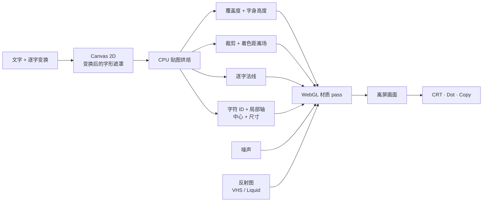

# Y2K Type Lab

[English](./README.md) · **简体中文**


一个在浏览器里做 Y2K 标题字的材质编辑器。输入文字，挑一套材质，再直接拖动、旋转和缩放画布里的每个字。反射、扫描线、点阵和挤出会跟着字一起变，不会留在原来的画布坐标上。

**[▶ 在线演示](https://sylvanyu.io/y2k-type-lab/)** · 需要浏览器支持 WebGL。


## 三套材质

<table>
  <tr>
    <td width="33.3%"></td>
    <td width="33.3%"></td>
    <td width="33.3%"></td>
  </tr>
  <tr>
    <td><strong>VHS Chrome</strong><br />镀铬底材、红青重影、逐行信号丢失、彩色外沿和 CRT 扫描线。</td>
    <td><strong>Dot Glitch</strong><br />Tektur 点阵字面、分层描边、透视挤出、信号错位和横向撕裂。</td>
    <td><strong>Liquid Chrome</strong><br />圆润字面、流动法线、柔和高光、挤出和干净的反射。</td>
  </tr>
</table>

VHS Chrome 和 Liquid Chrome 从图片里取得字面反射的颜色和细节。编辑器内置 Rose Citadel、Ice Citadel、Solar Obsidian、Prism Mercury 和 Neon Monsoon 五张反射图，也接受 `https:`、`data:image` 和 `blob:` 地址。远程图片需要允许跨域访问。

Dot Glitch 不读取反射图。它的字面来自距离场、程序化点阵、分层挤出和信号错位。

## 编辑器


左侧 Material Lab 放材质预设、反射图和运行中的材质贴图；右侧 Inspector 负责文字、表面、反射和后期参数。窄屏下，同一批控件会收进 Type、Field、Material 和 FX 四个标签。

### 逐字操作

| 输入 | 结果 |
| --- | --- |
| 点击字符 | 选中这个字 |
| 拖动字符 | 移动 |
| 拖动洋红手柄 | 旋转 |
| 旋转时按住 `Shift` | 吸附到 15° |
| 拖动青色手柄 | 缩放 |
| `Page Up` / `Page Down` 或 `[` / `]` | 切换上一个或下一个字符 |
| 方向键 | 每次移动 1 px |
| `Shift` + 方向键 | 每次移动 10 px |
| `Alt` / `Option` + 左右方向键 | 每次旋转 1° |
| `Alt` / `Option` + `Shift` + 左右方向键 | 每次旋转 15° |
| `Alt` / `Option` + 上下方向键 | 每次缩放 1% |
| `Alt` / `Option` + `Shift` + 上下方向键 | 每次缩放 10% |
| `Esc` | 取消选择 |

选中字符后，Inspector 里还可以直接填写 X、Y、旋转和缩放数值。**Reset Character** 清掉当前字符的变换，**Reset All Layout** 清掉整套逐字排版。

### 材质参数

| 分组 | 参数 |
| --- | --- |
| Type | 文字、字距和行高 |
| Chrome surface | 边缘圆润度、字身隆起和字面曲率 |
| Reflection | 反射图、环境映射范围、X/Y 偏移、反射率、光场强度、粗糙度和底色 |
| VHS Chrome | 扫描线间距和强度 |
| Liquid Chrome | 液态扭曲 |
| Dot Glitch | 点阵大小、描边厚度和故障强度 |
| Shared finish | 透视角度、挤出深度、边缘辉光、场景细节、边缘色和反射色 |

每套材质在页面打开期间各自保留一份参数。从 VHS Chrome 切去 Dot Glitch，再切回来，刚才调过的 VHS 参数还在。右上角的 **Reset** 只恢复当前预设并切回 Material 视图；文字和逐字变换不会被清掉。

画布上方的 **Semantic ID** 会把成品切成字符所有权图。左侧可展开的 Material Maps 显示当前帧实际使用的 Coverage、Body Height、Clip SDF、Shading SDF、Normal XY、噪声和字符 ID；每张卡片都对应当前渲染输入中的一个通道或缓冲区。

## 本地运行

克隆仓库后，在根目录启动一个静态文件服务器：

```bash
git clone https://github.com/sylvanyu-io/y2k-type-lab.git
cd y2k-type-lab
python3 -m http.server 4173
```

在已启用 WebGL 的浏览器里打开 [http://127.0.0.1:4173/](http://127.0.0.1:4173/)。渲染器优先使用 WebGL 2，不可用时回退到 WebGL 1。编辑器本身由静态文件组成，本地修改不需要安装依赖，也不用先构建应用。

## 渲染笔记

渲染器同时保留整段文字的合并轮廓，以及每个可见字符各自的表面数据。



### 从字形遮罩到表面贴图

Canvas 2D 先测量文字，再绘制已经平移、旋转和缩放过的字形。二维欧氏距离变换根据遮罩生成有符号距离场。

渲染器主要上传四类表面数据：

| 数据 | 内容 |
| --- | --- |
| Shape | 抗锯齿覆盖度、合并后的字身高度，以及 VHS Chrome 使用的交叠描边 |
| Distance | 范围较大的裁剪 SDF，和范围较短、更平滑的着色 SDF |
| Normal | 由 Edge Roll、Body Crown 和 Face Curve 合成的表面法线 |
| Semantic ID + metadata | 当前像素属于哪个字，以及这个字的局部旋转轴、中心和尺寸 |

合并距离场负责整段文字的外轮廓、挤出、辉光和阴影。法线走另一条路：每个字符先在自己的局部区域里计算，再按 Canvas 绘制顺序写回总图。两个字叠在一起时，前面的字仍保留自己的圆润曲面，不会和后面的字鼓成同一块。

调整 Edge Roll、Body Crown 或 Face Curve 时，程序复用已经缓存的逐字区域，只重算法线贴图。文字、字距、行高或逐字变换改变后，才会重建整套距离场。反射、颜色、粗糙度、深度、辉光、透视和信号参数留在着色器 uniform 里，不需要重新画字形遮罩。

### 材质坐标跟着字符走

每个可见字符都有自己的 ID。Semantic ID 贴图同时记录字符 ID 和旋转后的局部轴，另一张元数据贴图保存中心和尺寸。片元着色器借这两份数据，把画布坐标还原成当前字符内部的坐标。字符移动、旋转或缩放后，反射细节和 VHS 信号行仍按这个字自己的方向展开。

点击选字也读同一张所有权图。指针位置先还原到烘焙坐标，再查询 CPU 已经缓存的 ID 像素；每次点击都不用从 GPU 回读数据。

编辑文字时，最长公共子序列会匹配同一行里仍然存在的非空字符，并沿用原来的内部标识。往旁边插入或删掉一个字，大多数已有的逐字变换都能留下来。

### 三条材质路径

**Liquid Chrome** 用烘焙法线查询当前反射图。流动噪声先扰动法线，粗糙度通过纹理梯度选取更模糊的 mip 层级；底色、反射率、Fresnel 边缘、挤出、阴影和地面反射在同一个材质 pass 里合成。

**VHS Chrome** 复用同一套镀铬表面，再按字符自己的信号坐标叠加逐行丢失、横向偏移、红青重影和交叠描边。第二个 CRT pass 负责扫描线、磷光栅格、辉光、暗角和透视。

**Dot Glitch** 不读取反射图，而是从合并距离场取得轮廓，再铺上规则点阵、错位色层、撕裂行、分层描边和阶梯式挤出。它自己的显示 pass 负责透视和高光辉光。

三套材质都先写入同一张离屏纹理，再由 CRT、Dot 或 Copy pass 显示。窗口缩放只影响显示 pass，不必重建字形数据。

## 项目结构

```text
index.html                       编辑器结构与控件
art-text.css                     桌面端和窄屏布局
art-text.js                      交互、贴图烘焙、GLSL 和渲染
art-text-presets.js              三套材质的默认参数
art-text-fields.js               CPU 噪声、高度和着色距离场工具
assets/
  material-previews/             材质封面
  reflection-fields/             五张实际使用的反射图
  fonts/tektur/                  Dot Glitch 使用的字体
  readme/                        仓库封面和界面截图
```

## 许可

仓库中的代码和文档使用 [MIT License](./LICENSE)。

内置的 [Tektur 字体](./assets/fonts/tektur/README.md) 单独使用 [SIL Open Font License](./assets/fonts/tektur/OFL.txt)。
