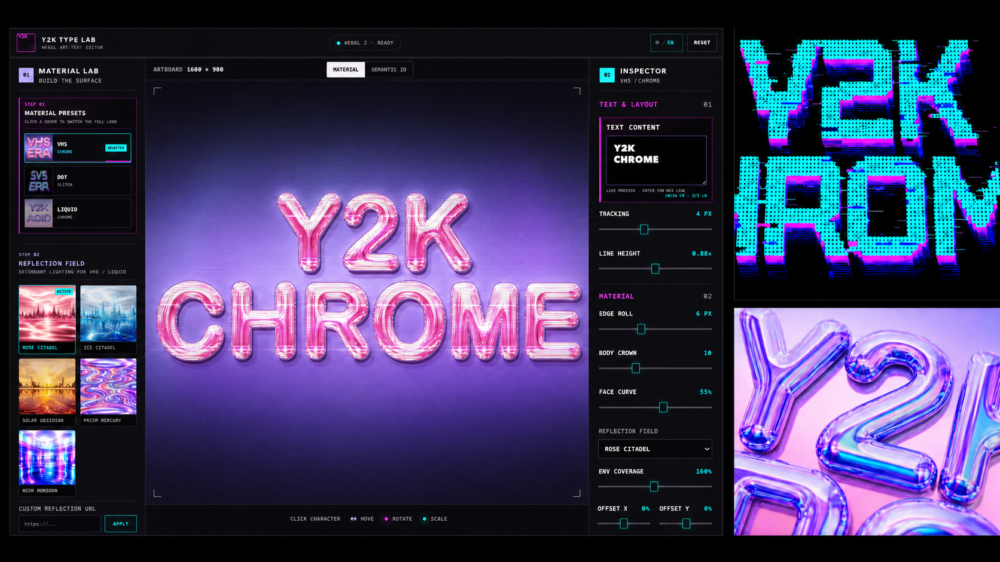
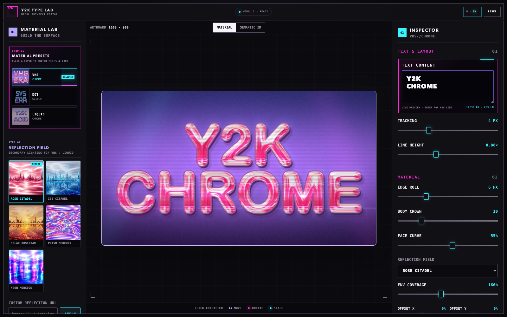

# Y2K Type Lab

[English](./README.md) · **简体中文**

[打开在线编辑器 →](https://sylvanyu.io/y2k-type-lab/)

一个用于制作镀铬、液态和故障艺术字的浏览器端 WebGL 2 编辑器。



Y2K Type Lab 把短文本渲染成固定 1600 × 900 画布上的着色器艺术字。选择材质和反射光场，调整表面参数，再直接在画布上移动、旋转和缩放单个字符。

编辑器本身只使用原生 HTML、CSS 和 JavaScript，可以直接从静态文件运行，不需要安装依赖、前端框架或应用构建步骤。仓库中的轻量部署脚本只负责把这些文件整理到线上子路由。

## 可以做什么

- 使用 VHS Chrome、Dot Glitch 和 Liquid Chrome 三套相互独立的材质预设。
- 通过字距、行高和多行控制排版短文本。
- 单独移动、旋转和缩放字符，同时让材质效果继续贴合字符。
- 为 VHS Chrome 和 Liquid Chrome 选择五套内置反射光场，也可以输入自定义图片 URL。
- 调整厚度、高光、扭曲、辉光、描边、圆点、扫描线等材质参数。
- 在设计过程中查看 Semantic ID 缓冲区和八张中间材质图。
- 在完整桌面布局或紧凑界面中使用英文、简体中文界面。

## 材质

| 预设 | 视觉特征 |
| --- | --- |
| VHS Chrome | 带扫描线、色彩分离、厚度和边缘辉光的反射镀铬效果。 |
| Dot Glitch | 使用 Tektur 圆点字面，叠加多层描边、透视厚度和信号扭曲。 |
| Liquid Chrome | 带有挤出、曲率、粗糙度和辉光控制的扭曲反射效果。 |

内置反射光场包括 Rose Citadel、Ice Citadel、Solar Obsidian、Prism Mercury 和 Neon Monsoon。反射光场用于 VHS Chrome 和 Liquid Chrome；Dot Glitch 使用自己的程序化表面。

## 编辑器界面



左侧面板用于选择材质预设和反射光场，中间是 1600 × 900 画布，右侧检查器包含文字、排版、单字、表面和特效参数。在较窄的屏幕上，同一组控制会整理到“文字、光场、材质、特效”四个标签中。

## 快速开始

```bash
git clone https://github.com/sylvanyu-io/y2k-type-lab.git
cd y2k-type-lab
python3 -m http.server 4173
```

在支持 WebGL 2 的现代浏览器中打开 [http://127.0.0.1:4173/](http://127.0.0.1:4173/)。项目需要通过本地 HTTP 服务器运行，不支持直接双击打开 `index.html`。

## 线上部署

公开版本通过 Cloudflare Workers 运行在 [sylvanyu.io/y2k-type-lab/](https://sylvanyu.io/y2k-type-lab/)。Workers Builds 监听 `main` 分支；每次推送都会执行 `pnpm run build`，再使用仓库锁定的 Wrangler 版本完成部署。

`scripts/build-site.mjs` 只把运行所需文件复制到 `dist/y2k-type-lab/`。让 `dist` 内的目录结构与线上 URL 一致后，Cloudflare 的静态资源处理器就能从子路由提供应用，同时继续使用相对路径加载字体、预览图、反射场、样式和脚本。

## 使用方法

1. 在左侧选择一套材质预设。
2. 在 **Text & Layout** 中输入一至三行文字。
3. 调整字距和行高。
4. 使用 VHS Chrome 或 Liquid Chrome 时，选择一套反射光场，或粘贴允许跨域访问的图片 URL。
5. 调整材质和特效参数，画布会同步更新。
6. 在画布上选中字符。拖动字符本体可以移动；洋红色和青色控制柄分别用于旋转和缩放，也可以使用键盘操作。
7. 需要检查渲染数据时，切换到 **Semantic ID**，或展开中间材质图预览。

**Reset** 只恢复当前材质和视图参数，不会替换文字，也不会清除逐字变换。

### 键盘操作

| 按键 | 操作 |
| --- | --- |
| `Page Up` / `Page Down` 或 `[` / `]` | 选择上一个或下一个字符。 |
| 方向键 | 将选中字符移动 1 px。 |
| `Shift` + 方向键 | 将选中字符移动 10 px。 |
| `Alt` / `Option` + `←` / `→` | 旋转 1°；同时按住 `Shift` 时旋转 15°。 |
| `Alt` / `Option` + `↑` / `↓` | 缩放 1%；同时按住 `Shift` 时缩放 10%。 |
| 拖动旋转控制柄时按住 `Shift` | 以 15° 为步进吸附。 |
| `Escape` | 取消字符选择。 |

## 渲染原理

```text
Canvas 2D 文字
    → CPU 距离场与法线图
    → 字形元数据
    → WebGL 2 材质阶段
    → 显示阶段
```

文字首先通过 Canvas 2D 栅格化到标准的 1600 × 900 分辨率。二维欧氏距离变换为完整文字轮廓生成合并的有符号距离场，同时生成字身高度场和着色距离场。

每个字符还拥有独立的感兴趣区域。法线和着色数据按字符分别生成，再按照绘制顺序合成。因此字符重叠时仍会保留可用的局部表面信息，而不是膨胀成一整块形状。

Semantic ID 纹理记录字符 ID 和局部旋转轴，另一张 256 × 2 的元数据纹理记录每个字符的中心和尺寸。镀铬材质路径利用这两张纹理恢复字符局部坐标，所以字符移动、旋转或缩放后，反射和 VHS 信号效果仍能保持对齐。包括 Dot Glitch 在内的轮廓相关效果，则通过重建后的距离场跟随变换后的字形。

WebGL 2 在一个全屏四边形上采样形状、距离、法线、噪声和反射光场纹理。结果先写入固定 1600 × 900 帧缓冲区，再通过当前材质的复制、CRT 或圆点显示阶段适配界面尺寸。

## 项目结构

| 路径 | 用途 |
| --- | --- |
| `index.html` | 编辑器结构和脚本加载入口。 |
| `art-text.css` | 桌面与紧凑界面样式。 |
| `art-text.js` | Canvas 处理、WebGL 着色器与渲染、交互控制和语言文本。 |
| `art-text-presets.js` | 三套材质预设的默认状态。 |
| `art-text-fields.js` | 生成噪声、字身高度和着色距离场的 CPU 工具。 |
| `assets/fonts/tektur/` | 本地 Tektur 字体文件及许可。 |
| `assets/material-previews/` | 材质预览图和来源元数据。 |
| `assets/reflection-fields/` | 内置反射图像。 |
| `artifacts/` | 比较反射投影时使用的参考截图。 |

## 浏览器要求

- 浏览器需要支持 WebGL 2、Canvas 2D、Font Loading API、Pointer Events 和现代 JavaScript。
- 项目没有 WebGL 1 备用渲染路径。
- Dot Glitch 使用内置 Tektur 字体；VHS Chrome 和 Liquid Chrome 使用系统字体栈，因此不同平台上的字形可能略有差异。
- 自定义反射图片可使用 `http:`、`https:` URL、PNG/JPEG/WebP/AVIF Data URL 或 `blob:` URL；远程服务器必须允许跨域读取图片。任一边超过 8,192 px 或总像素超过 3,200 万的图片会被拒绝。

## 当前限制

- 渲染画布固定为 1600 × 900。界面可以响应式缩放，但标准作品分辨率暂时不能修改。
- 输入计数上限为 36 个 UTF-16 代码单元；最多渲染三行，每行 18 个字素簇。
- 图片导出功能尚未启用。
- 材质参数和逐字变换不会跨会话保存；只有界面语言会保存在本地。
- 暂无撤销历史、自定义字体导入、图层系统和动画时间线。
- 文字表面缓冲区在 CPU 上生成，因此重建文字的开销高于只修改着色器参数。

## 许可与字体

项目目前还没有添加覆盖全部代码的许可。内置的 [Tektur 字体](./assets/fonts/tektur/README.md) 按照 [SIL Open Font License](./assets/fonts/tektur/OFL.txt) 分发。
